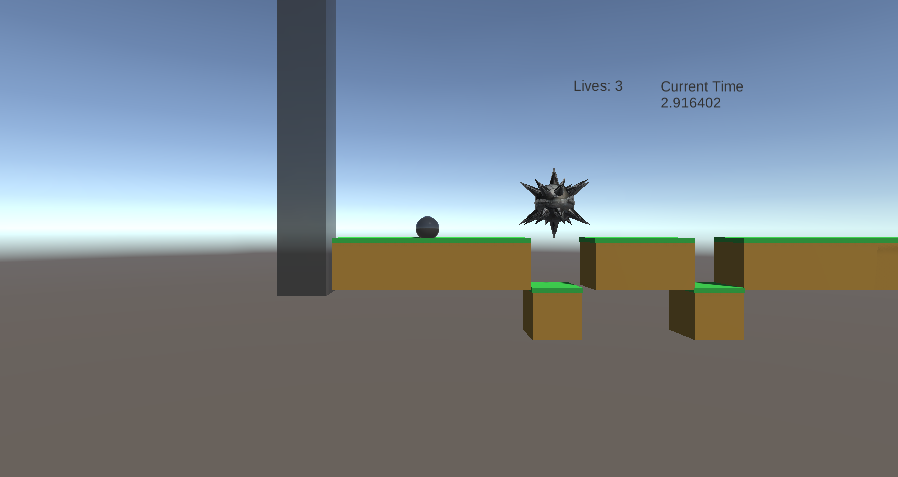

# Speedybois

Deployed Link: https://seiplet93.itch.io/speedybois
## Technologies
- Unity is the game engine and program I used for developing this game. 
- The scripts for the player, gamestate, and level objecets were written using Unity's flavor of C#
- The game was built using WebGL, which uses HTML to render the game in a browser window.

## Approach
I started the project by watching C# and Unity tutorials online for most of the first day. I had never used either prior to this project, so this helped a lot with getting comfortable with the software/language. From there my goal was to finish MVP quickly so I could focus on adding extra features that I knew would help flesh the game out. I ended up getting quite distracted with adding in animations and other extras before the core game was finished. If I had more time, the timeline of the project probably would've been more organized.
## Installation
The game is deployed at https://seiplet93.itch.io/speedybois. If you wish to clone the code to adjust the game files then the only dependencies are Unity and setting the build to WebGL.

## User Stories
As a user, I want to...
- Play a poorly optimized game with bad physics.
- Play a game with friends and compare times when beating a level.
- Play a free game that is accessible in the browser.

## Bugs, unsolved problems
- Physics are horrible at the moment.
- Need to add multiplayer.
- Need to add character model and animations.
- Add High-Scores/personal best times.
