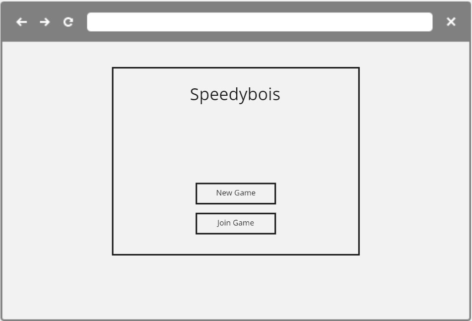
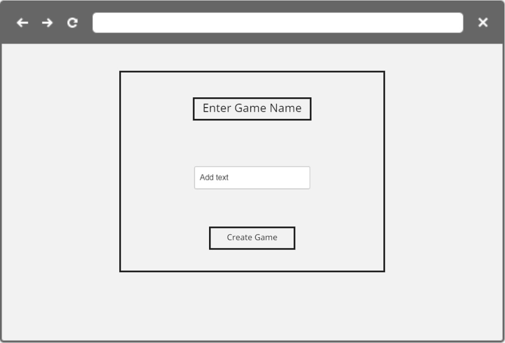
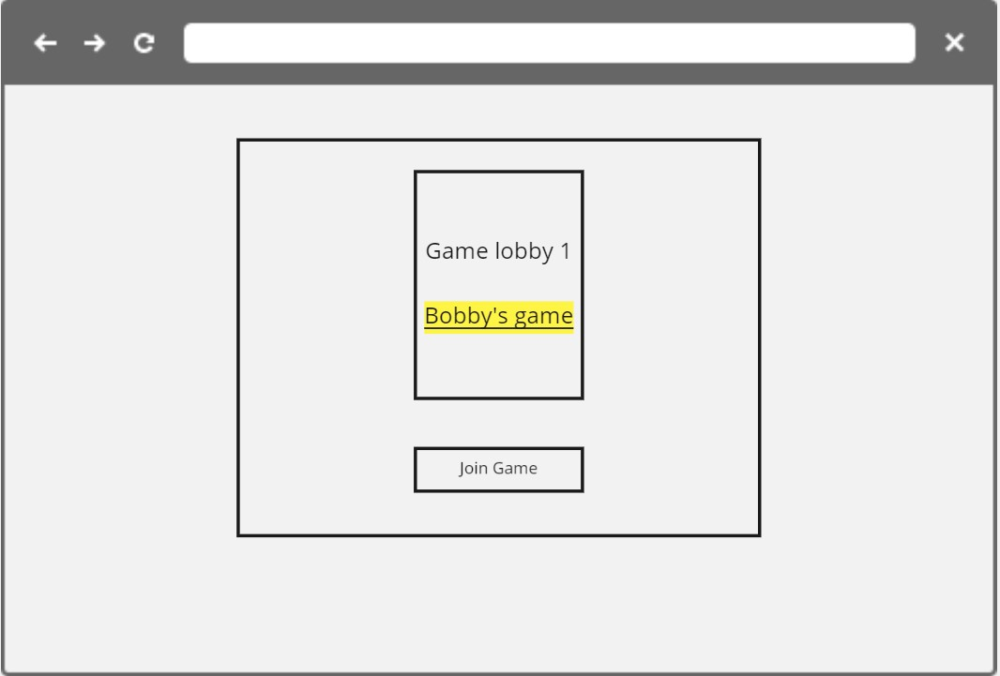
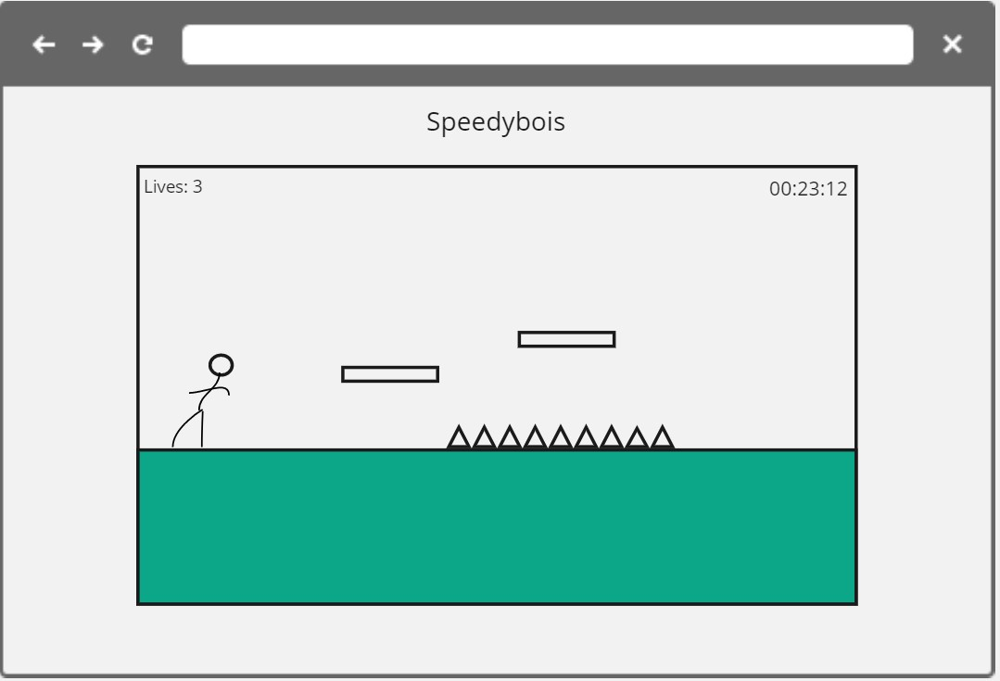

## Technologies

- Unity
- C#
- WebGL

## Description

Speedybois is a multiplayer(hopefully) platforming game. The goal is to be faster than your friends while avoiding dangerous obstacles and environment elements on your way to the finish line.

## Wireframes

### Main Menu

### Create Game

### Join Game

### Game

## MVP

- Functioning platforming game with a start and finish line
- Ability for character to move left and right, as well as jump
- Display the user's time once the finish line is crossed
- Have player "lives", Game over if lives reach 0

# Stretch

- Create environmental hazards
- Implement multiplayer
- Create different characters for user's to play as (different speeds, amount of lives)
- Database storing user's fastest times
- Add Music
